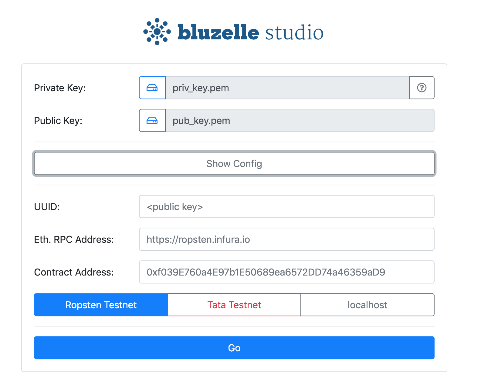
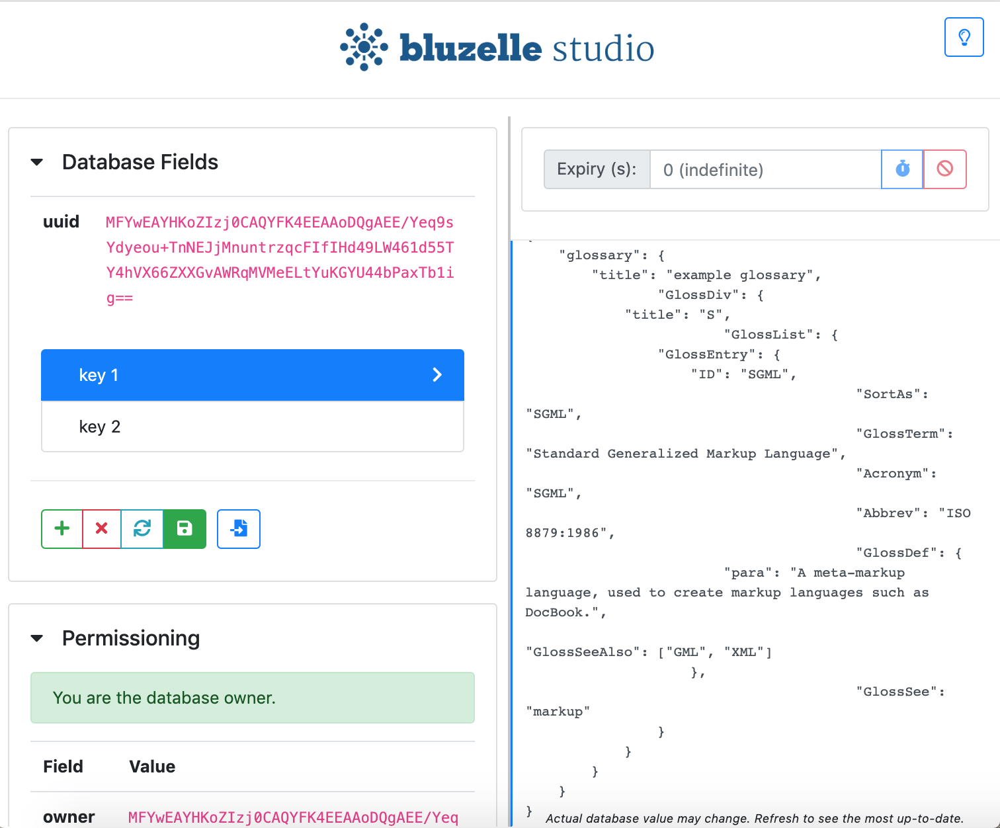

This app is used to make changes to the [Bluzelle](https://bluzelle.com/) database.




## Instructions

Be sure to have `NodeJS` and `yarn` installed on your machine. This application has last been verified with Node version 11.x.

You must first build be app (see below). Afterwards, you have the option of running it in-browser or on desktop with Electron. You may also choose to download pre-built desktop binaries for [Debian](https://bluzelle.jfrog.io/bluzelle/list/debian-local/pool/) or [OSX](https://bluzelle.jfrog.io/bluzelle/list/OSX/).

### Building the app

```
1. yarn
2. yarn build
```

The static output will be placed in the `dist/` folder.

### Running the app in-browser

You need to serve the `dist/` on a server. We will show how to do this with a simple JavaScript tool.

```
1. yarn add http-server -g
2. cd dist
3. http-server

Starting up http-server, serving ./
Available on:
  http://127.0.0.1:8080


OR use the standard HTTP port 80:


3. sudo http-server -p 80

Starting up http-server, serving ./
Available on:
  http://127.0.0.1:80
```

### Running the app on desktop

We use `Electron` to bundle the web app for desktop.

```
1. Build the app (see above)
2. cd desktop
3. yarn
4. yarn start
```

### Bundling desktop executables

Note that the commands given below can cross-compile for different platforms (verified on Mac). The binaries are placed in the `dist` folder.

```
1. Ensure you can run the app (see above)
2. cd desktop
3. yarn package-mac|package-linux|package-windows
```
