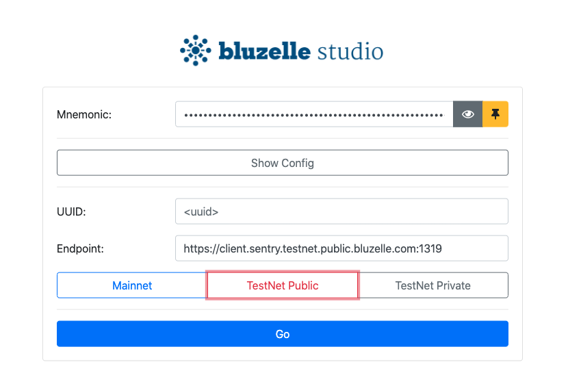
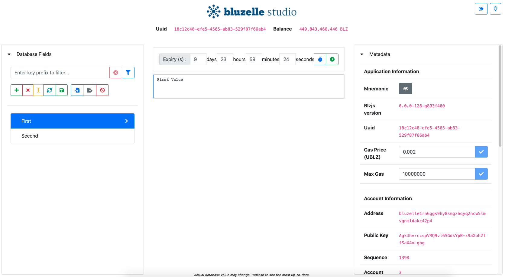

This app is used to make changes to the [Bluzelle](https://bluzelle.com/) database.






## Instructions

Be sure to have `NodeJS` and `npm` installed on your machine. You must first build be app (see below). Afterwards, you have the option of running it in-browser or on desktop with Electron. You may also choose to download pre-built desktop binaries for [Debian](https://bluzelle.jfrog.io/bluzelle/list/debian-local/pool/) or [OSX](https://bluzelle.jfrog.io/bluzelle/list/OSX/).


### Building the app

```
1. npm install
2. npm run dev-compile
```

The static output will be placed in the `dist/` folder.


### Running the app in-browser

You need to serve the `dist/` on a server. We will show how to do this with a simple JavaScript tool.

```
1. npm install http-server -g
2. cd dist
3. http-server

Starting up http-server, serving ./
Available on:
  http://127.0.0.1:8080
```


### Running the app on desktop

We use `Electron` to bundle the web app for desktop.

```
1. Build the app (see above)
2. cd desktop
3. npm install
4. npm run start
```


### Bundling desktop executables 

```
1. Ensure you can run the app (see above)
2. cd desktop
3. npm run package-mac|package-linux|package-windows
```
